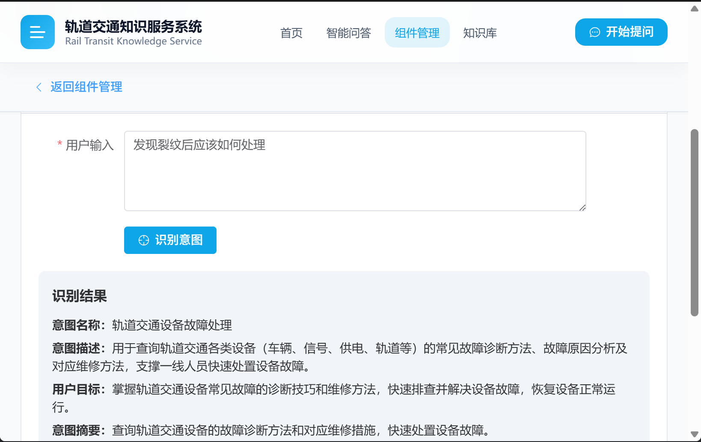
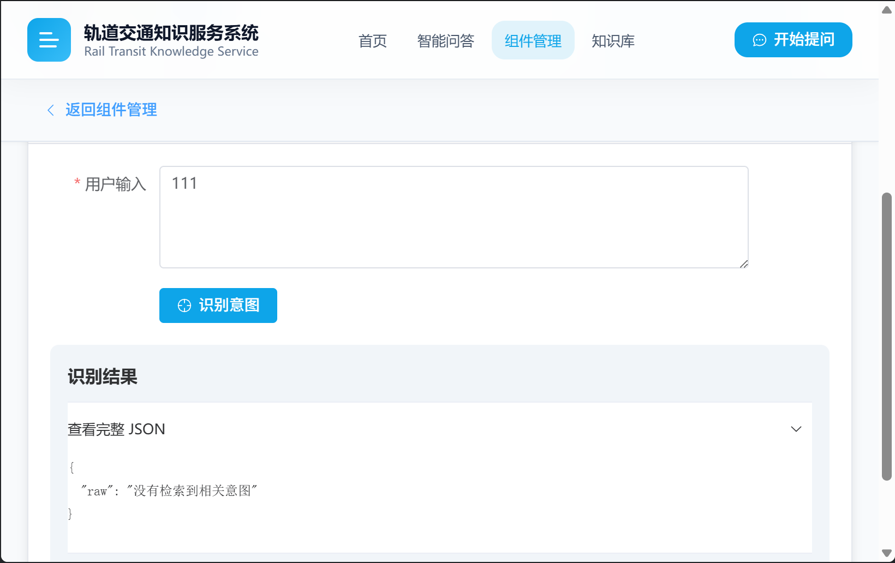

# 意图识别模块使用手册

## 目录
1. [概述](#概述)
2. [处理流程](#处理流程)
3. [环境配置](#环境配置)
4. [接口说明](#接口说明)
5. [算法详情](#算法详情)
6. [输入输出规范](#输入输出规范)

---

## 概述

意图识别模块是轨道交通智能问答系统的核心组件，基于 **RAG（检索增强生成）** 架构实现。模块通过结合向量检索和大语言模型，准确识别用户查询的意图，为后续的知识检索和答案生成提供基础。

### 核心能力
- **语义理解**：基于 BGE-M3 嵌入模型理解用户查询的深层语义
- **混合检索**：结合稠密向量与稀疏向量进行相似度检索
- **智能排序**：使用 RRF（Reciprocal Rank Fusion）算法融合多路召回结果
- **精确匹配**：通过本地部署的大语言模型进行最终意图确认

---

## 处理流程

意图识别模块采用 **RAG（检索增强生成）** 架构，处理流程如下：

```
用户查询 → 文本编码 → 混合检索 → RRF排序 → LLM确认 → 意图结果
```

**流程说明**：

1. **用户查询输入**：接收用户的自然语言查询文本
2. **文本编码（BGE-M3）**：使用BGE-M3模型将查询文本编码为稠密向量（1024维）和稀疏向量（250002维），分别捕获语义信息和关键词信息
3. **混合检索（Milvus）**：在向量数据库中同时进行稠密向量检索和稀疏向量检索，召回Top-K相关意图
4. **RRF排序**：使用Reciprocal Rank Fusion算法融合两路检索结果，得到综合排序
5. **LLM确认（Qwen3-8B）**：将检索到的候选意图和用户查询输入大语言模型，由模型判断并输出最匹配的意图
6. **意图结果输出**：返回完整的结构化的意图信息，包括意图ID、名称、描述等

### 技术栈

- **向量数据库**：Milvus 2.6.9，用于存储和检索意图向量
- **嵌入模型**：BGE-M3，用于文本向量化，生成稠密向量和稀疏向量
- **大语言模型**：Qwen3-8B (vLLM本地部署)，用于意图确认和最终排序
- **LLM框架**：LangChain 0.3.21 + langchain-openai 1.1.10，用于LLM调用和提示管理
- **后端框架**：FastAPI 0.135.1，用于提供API服务

---

## 环境配置

### 1. 配置文件

配置文件位置：走后端 API 时在 **`backend/.env`**（或 Docker 仓库根 `.env`）；仅单独跑本目录脚本时用 `algorithm/intent_recognition_model/.env`。

```env
# Milvus 配置
MILVUS_URI=http://localhost:19530
MILVUS_CONSISTENCY_LEVEL=Strong
COLLECTION_NAME=intent_rag

# BGE-M3 模型路径（相对仓库根）
MODEL_PATH=models/bge_m3_model

# 意图数据路径
DATA_DIR=/home/admin_user_2/yangziyi/qasystem/algorithm/intent_recognition_model/data/intent.json

# 日志路径
LOG_PATH=/home/admin_user_2/yangziyi/qasystem/logs

# 可选配置
MAX_DROP_RETRIES=3
DROP_RETRY_DELAY=2
```

### 2. 依赖安装

```bash
# 进入意图识别模块目录
cd algorithm/intent_recognition_model

# 安装依赖
pip install -r requirements.txt
```

### 3. 依赖服务

- **Milvus**：http://localhost:19530，向量数据库服务，用于存储和检索意图向量
- **LLM服务**：http://localhost:9999/v1，Qwen3-8B模型服务，用于意图确认和排序

---

## 接口说明

### 1. HTTP API 接口（后端提供）

#### 1.1 健康检查

```http
GET /api/component/intent-recognition/health
```

**响应示例**：
```json
{
  "status": "ok"
}
```

**错误响应**：
```json
{
  "status": "unavailable",
  "detail": "意图识别模块不可用: xxx"
}
```

#### 1.2 意图识别

```http
POST /api/component/intent-recognition/recognize
Content-Type: application/json

{
  "text": "发现裂纹后应该怎么处理？"
}
```

**请求参数**：

- **text** (string, 必填)：用户查询文本

**响应示例**：

```json
{
  "data": {
    "intent_id": "INT20260211001",
    "version": "1.0",
    "domain": "轨道交通设备运维",
    "create_time": "2026-02-11T10:00:00+08:00",
    "update_time": "2026-02-11T11:30:00+08:00",
    "status": "active",
    "tags": ["轨道交通", "设备检查", "部件排查"],
    "intent_name": "轨道交通设备部件检查",
    "intent_description": "用于查询轨道交通各类设备（含车辆、信号、供电、轨道等）的组成结构...",
    "sample_utterances": [
      "轨道交通车辆的关键部件有哪些，怎么检查？",
      "信号设备的组成部分及检查要点是什么？"
    ],
    "core_keywords": ["轨道交通", "设备部件", "检查要点", "关键部位", "设备组成"],
    "intent_summary": "查询轨道交通设备组成及关键部件的检查相关内容，支撑巡检工作。",
    "user_goal": "获取轨道交通各类设备的组成信息，掌握关键部件的检查方法和要点，完成部件巡检任务。"
  }
}
```

**错误响应**：

```json
{
  "detail": "没有检索到相关意图"
}
```

### 2. Python API 接口（直接调用）

```python
from intent_recognition.intent_app import IntentRecognition

# 初始化识别器
recognizer = IntentRecognition()

# 执行意图识别
result = recognizer.generate_result("你的查询文本")

```

---

## 算法详情

### 1. 整体流程

```
用户查询 → 文本编码 → 混合检索 → RRF排序 → LLM确认 → 意图结果
```

### 2. 文本编码（BGE-M3）

**模型**：BAAI/bge-m3

**输出**：
- **稠密向量（Dense）**：1024维，捕获语义信息
- **稀疏向量（Sparse）**：250002维，捕获关键词信息

**编码示例**：
```python
encoder = HybridEncoder()
vectors = encoder.encode_text_hybrid("查询文本")
vectors["dense"]  -> List[float], 长度1024，稠密向量
vectors["sparse"] -> scipy稀疏矩阵
```

### 3. 混合检索（Milvus）

**检索策略**：

- **稠密向量检索**：在 `dense_vector` 字段上使用 IP（内积）度量，捕获语义相似度
- **稀疏向量检索**：在 `sparse_vector` 字段上使用 IP（内积）度量，捕获关键词匹配

**RRF排序**：
```python
reranker = RRFRanker(k=60)
# k值越小越强调top结果，免调参、抗噪声
```

**检索参数**：
```python
dense_search_param = {
    "metric_type": "IP",
    "params": {
        "nprobe": 16,
        "radius": 0.4,
        "range_filter": 1
    }
}

sparse_search_param = {
    "metric_type": "IP",
    "params": {
        "topk": 100,
        "radius": 0.4,
        "range_filter": 1
    }
}
```

### 4. LLM确认（Qwen3-8B）

**提示模板**：
```
System: 你是一个意图识别的专家，需要你根据用户输入的询问以及相关的意图列表选取最合适的意图

Human: 我的问题是{query}，请帮我筛选出最恰当的意图，并将它原封不动的输出
```

**输出格式**：结构化意图对象（Pydantic模型）

---

## 输入输出规范

### 1. 意图数据结构

```json
{
  "intent_id": "string",           // 意图唯一标识
  "version": "string",             // 版本号
  "domain": "string",              // 业务域
  "create_time": "string",         // 创建时间（ISO8601）
  "update_time": "string",         // 更新时间（ISO8601）
  "status": "string",              // 状态：active/archive/draft
  "tags": ["string"],              // 业务标签数组
  "intent_name": "string",         // 意图名称
  "intent_description": "string",  // 意图详细描述
  "sample_utterances": ["string"], // 典型用户表述样本
  "core_keywords": ["string"],     // 核心关键词
  "intent_summary": "string",      // 意图摘要
  "user_goal": "string"            // 用户目标
}
```

### 2. 意图数据示例

```json
{
  "intent_id": "INT20260211001",
  "version": "1.0",
  "domain": "轨道交通设备运维",
  "create_time": "2026-02-11T10:00:00+08:00",
  "update_time": "2026-02-11T11:30:00+08:00",
  "status": "active",
  "tags": ["轨道交通", "设备检查", "部件排查"],
  "intent_name": "轨道交通设备部件检查",
  "intent_description": "用于查询轨道交通各类设备（含车辆、信号、供电、轨道等）的组成结构...",
  "sample_utterances": [
    "轨道交通车辆的关键部件有哪些，怎么检查？",
    "信号设备的组成部分及检查要点是什么？"
  ],
  "core_keywords": ["轨道交通", "设备部件", "检查要点"],
  "intent_summary": "查询轨道交通设备组成及关键部件的检查相关内容...",
  "user_goal": "获取轨道交通各类设备的组成信息..."
}
```

### 3. Milvus集合Schema

**元数据字段**：
- **intent_id** (VARCHAR 100)：主键，意图唯一标识
- **version** (VARCHAR 10)：版本号
- **domain** (VARCHAR 256)：业务域
- **create_time** (VARCHAR 100)：创建时间
- **update_time** (VARCHAR 100)：更新时间
- **status** (VARCHAR 10)：状态（active/archive/draft）

**文本字段**：
- **intent_name_text** (VARCHAR 256)：意图名称文本
- **intent_description_text** (VARCHAR 1024)：意图描述文本
- **intent_summary_text** (VARCHAR 1024)：意图摘要文本
- **user_goal_text** (VARCHAR 1024)：用户目标文本

**向量字段**：
- **dense_vector** (FLOAT_VECTOR 1024)：稠密向量，用于语义检索
- **sparse_vector** (SPARSE_FLOAT_VECTOR)：稀疏向量，用于关键词检索

**数组字段**：
- **tags** (ARRAY VARCHAR 50)：业务标签数组
- **sample_utterances** (ARRAY VARCHAR 300)：典型用户表述样本数组
- **core_keywords** (ARRAY VARCHAR 50)：核心关键词数组

---

## 实现效果截图

### 1. 成功查询意图的效果



### 2. 查询不到意图的效果


